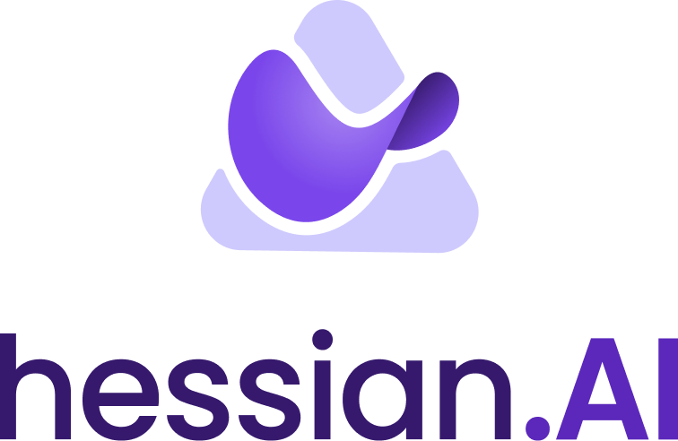
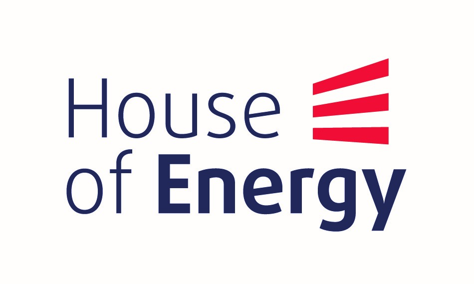
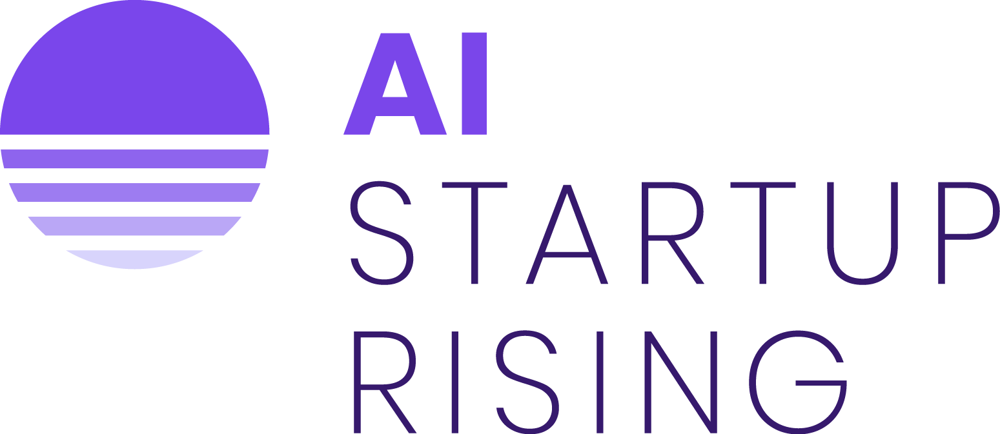
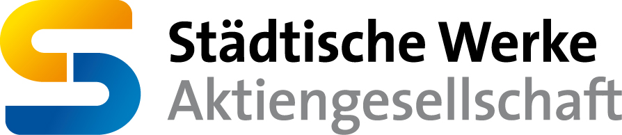

# Residual Load Forecasting Challenge

## Introduction

The decentralized expansion of renewable energies is an important pillar on the way to the energy transition. Self-generation systems on industrial and commercial sites are a major field of application. Primarily, customers using the electricity they generate themselves and purchase electricity if the quantities generated are insufficient. The resulting residual load (residual load = energy demand - self generated energy) must in any case be provided by the energy supplier.

In order to ensure stable energy supply, the energy suppliers rely on forecasts of these residual loads. In the past, those residual loads could be forecast based on many years of experience. Now, the share of solar energy systems and therefore the amount of energy self-generation increases more and more. This makes the task of forecasting the residual loads more and more complex as there are dependencies to external factors like the weather. However, the forecast is necessary to maintain a proper supply operation. For this reason, it is necessary to have a forecast of the residual load that is as accurate as possible. 

## Problem Statement

Participants are asked to develop an algorithm which forecasts the residual loads. Its your choice if you want to tackle the problem univariate or multivariate by including external factors like the weather (Probably multivariate will do better 🤓).

## Dataset

Will be provided soon.

## How to Attend

1. Attend our online Kick-Off on the 15th of December 2022 from 10:00 AM - 12:00 AM. The link to the meeting will be provided soon.
2. There will be a Chat room hosted during the challenge. We will provide a link to the chat room soon.
3. Start developing your forecasting algorithm :)

## How to Submit

Once the challenge starts, we will provide the test data (without the labels of course). You are asked to submit your solution before the end of the challenge. Details about the submission process itself will be provided soon.

## Prizes

Will be announced soon. But the price pool which will be distributed between the 1st 2nd and 3rd is some in the order of magnitude of 500€-1000€.

## Timeline

- Challenge Kickoff 15th of December 2022 from 10:00 AM - 12:00 AM
- Challenge End 30th of January 2023
- The date for the final event "Pizza and Pitch", which includes an award ceremony will be announced soon. 

## Evaluation Criteria

Will be provided soon

## Organizers

|    |    |    |    |
|:-------------:|:-------------:|:-------------:|:-------------:|
| [hessian.AI](https://hessian.ai/)| [House of Energy](https://www.house-of-energy.org/) | [AI Startup Rising](https://hessian.ai/entrepreneurship/)| [Städtische Werke AG, Kassel](https://www.sw-kassel.de/privatkunden/startseite/)|

